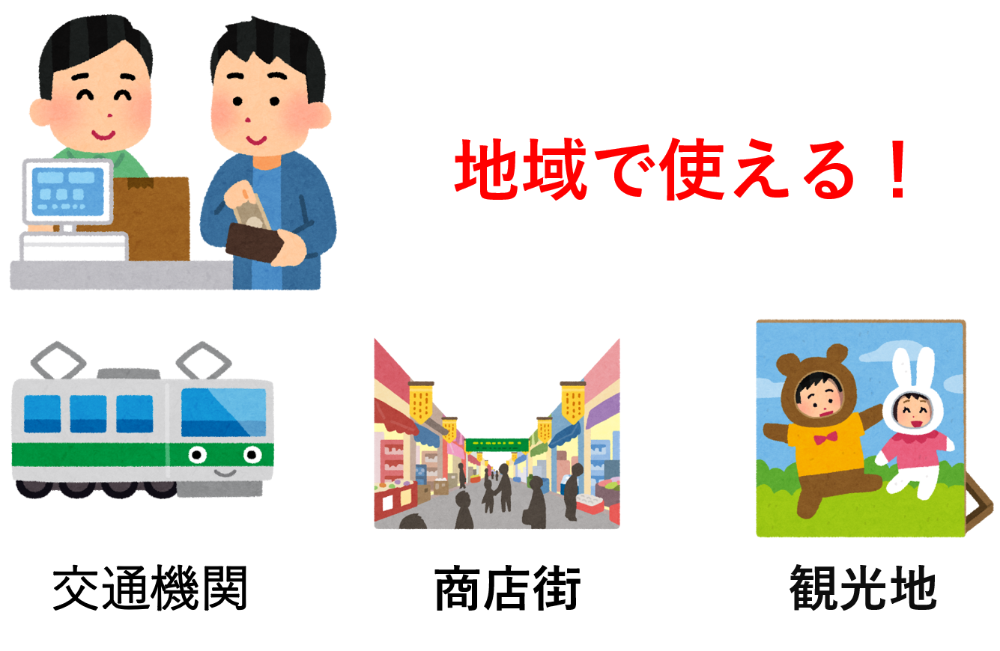

## トリカとは　　
  
トリカとは、地域の人口不足の解消、地域活性化を目的とした、地域内外の納税者を対象の仮想通貨です。
トリカは、ふるさと納税の寄付による返礼品に付随される形、住民税の納税によって自治体から送られてくる形によって入手することができます。
そのトリカは、ふるさと納税を行った自治体、住民税を支払った自治体の商店街、交通機関、観光地で仮想通貨として利用することができます。

  

[利用者の方はこちら](./client "")   [自治体の方はこちら](./govement"")     [導入者の方はこちら](./store "")    
