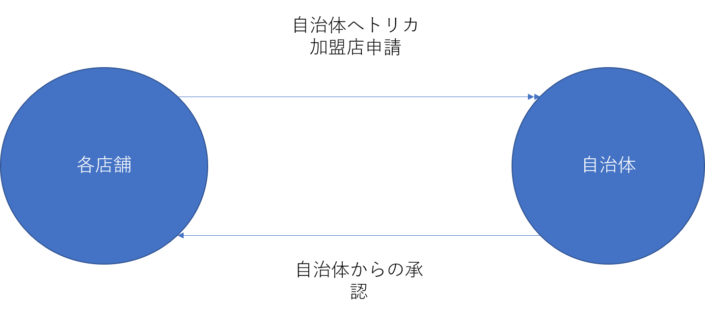
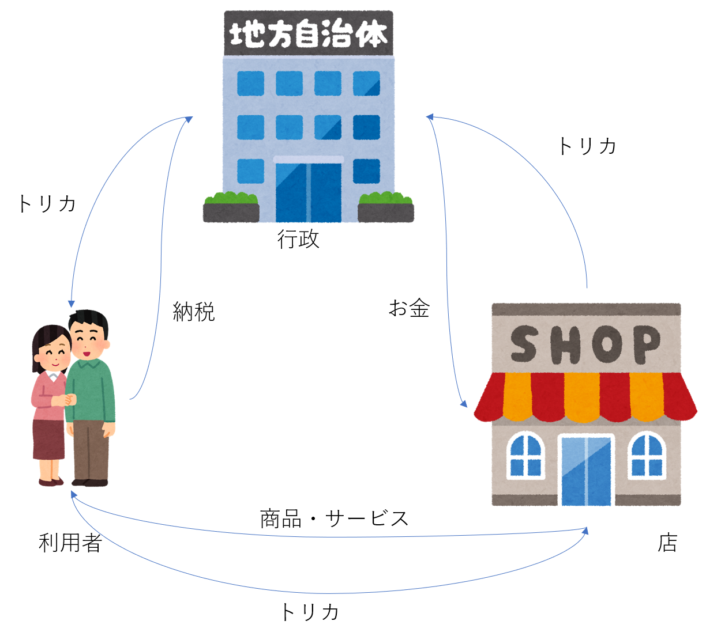

## トリかを導入する店舗様用ページ
#### トリカを導入するメリット
 トリカはその地域独自の店でしか使えないようになっています。(大手ショッピングモールやチェーン店でも使えません。)  
 これによってトリカ利用者はその地域の店を利用するようになり、集客効果が見込めます。  
#### 導入方法
 トリカの加盟店申請方法は地域の行政に申請を送り、承認が下りればトリカを導入することができます。

#### トリかから現金への換金方法
 トリカを現金に換金する方法はお客様から頂いたトリカを自治体に郵送し、順次店舗へ換金していきます。
 

[トップページへ](./index)
